# SeamQ User Guide

SeamQ is a .NET CLI tool that statically analyzes Angular workspaces to detect interface boundaries (seams), generate aerospace-grade Interface Control Documents (ICDs), and produce PlantUML architecture diagrams.

---

## Table of Contents

- [Installation](#installation)
- [Quick Start](#quick-start)
- [Scanning Workspaces](#scanning-workspaces)
- [Listing Detected Seams](#listing-detected-seams)
- [Generating ICD Documents](#generating-icd-documents)
- [Generating Diagrams](#generating-diagrams)
  - [Class Diagrams](#class-diagrams)
  - [Sequence Diagrams](#sequence-diagrams)
  - [C4 Architecture Diagrams](#c4-architecture-diagrams)
- [Inspecting Seams](#inspecting-seams)
- [Validating Contracts](#validating-contracts)
- [Baseline Diffing](#baseline-diffing)
- [Exporting Data](#exporting-data)
- [Configuration](#configuration)
- [Rendering Diagrams to PNG/SVG](#rendering-diagrams-to-pngsvg)
- [CLI Reference](#cli-reference)

---

## Installation

Install SeamQ as a global .NET tool:

```bash
dotnet tool install --global seamq
```

Verify the installation:

```bash
seamq --version
```

---

## Quick Start

Analyze an Angular workspace in three commands:

```bash
# 1. Scan the workspace
seamq scan ./my-angular-app

# 2. Generate ICD documents
seamq generate --all --format md html

# 3. Generate architecture diagrams
seamq diagram --all
```

Output lands in `./seamq-output/` by default, organized by seam ID.

### Full Pipeline Example

```bash
# Scan with a saved baseline
seamq scan ./src/Dashboard.Web --save-baseline baseline.json --verbose

# List what was found
seamq list

# Generate everything
seamq generate --all --format md html --output-dir ./docs-out
seamq diagram --all --output-dir ./docs-out
seamq validate --all
seamq export --all --output-dir ./docs-out

# Browse the results
seamq serve
```

---

## Scanning Workspaces

The `scan` command analyzes Angular workspaces and builds the seam registry.

### Scan a single workspace

```bash
seamq scan C:/projects/Dashboard/src/Dashboard.Web
```

### Scan multiple workspaces

```bash
seamq scan ./apps/shell ./libs/shared ./plugins/reporting
```

### Scan with a baseline for later diffing

```bash
seamq scan ./my-app --save-baseline baseline.json
```

### Scan with exclusions

```bash
seamq scan ./my-app --exclude "**/*.spec.ts" "**/__mocks__/**"
```

### Disable caching for a fresh scan

```bash
seamq scan ./my-app --no-cache
```

### Typical output

```
[ok] scanned Dashboard.Web (6 projects, 228 exports)
found 4 seams across 1 workspaces.
```

---

## Listing Detected Seams

After scanning, list all detected seams:

```bash
seamq list
```

### Filter by type

```bash
seamq list --type plugin-contract
seamq list --type http-api-contract
```

### Filter by confidence

```bash
seamq list --confidence 0.8
```

### Filter by provider workspace

```bash
seamq list --provider Dashboard.Web
```

### Seam Types

| Type | Description |
|------|-------------|
| `plugin-contract` | Interfaces, tokens, abstract classes crossing workspace boundaries |
| `shared-library` | Barrel exports consumed across workspaces |
| `message-bus` | RxJS Subjects, NgRx actions/selectors |
| `route-contract` | loadChildren, loadComponent, route guards |
| `state-contract` | Angular Signal state, NgRx patterns |
| `http-api-contract` | SignalR hubs, backend service interfaces |

---

## Generating ICD Documents

Generate Interface Control Documents for your seams.

### Generate Markdown ICDs for all seams

```bash
seamq generate --all --format md
```

### Generate both Markdown and HTML

```bash
seamq generate --all --format md html
```

### Generate for a specific seam

```bash
seamq generate 68e7766a4dd5f012 --format html
```

### Specify output directory

```bash
seamq generate --all --format md html --output-dir ./docs/icds
```

ICD documents include:
- Introduction and scope
- Interface overview with architecture layers
- Registration contracts (tokens, providers)
- Component input/output contracts
- Injectable service APIs
- Data objects at the boundary
- Lifecycle and state management
- Protocols
- Traceability matrix
- Diagram index

---

## Generating Diagrams

SeamQ generates PlantUML diagrams across three categories: class, sequence, and C4 architecture. All diagrams are **standalone** `.puml` files that render without network access or external dependencies.

### Generate all diagrams for all seams

```bash
seamq diagram --all
```

### Generate only class diagrams

```bash
seamq diagram --all --type class
```

### Generate only sequence diagrams

```bash
seamq diagram --all --type sequence
```

### Generate only C4 diagrams

```bash
seamq diagram --all --type c4-component
seamq diagram --all --type c4-container
seamq diagram --all --type c4-context
```

### Generate diagrams for a specific seam

```bash
seamq diagram 68e7766a4dd5f012
seamq diagram 68e7766a4dd5f012 --type sequence
```

---

### Class Diagrams

Class diagrams show the static structure of the contract surface.

#### API Surface

Shows all interfaces, types, enums, and injection tokens at the seam boundary.

```bash
seamq diagram --all --type class
```

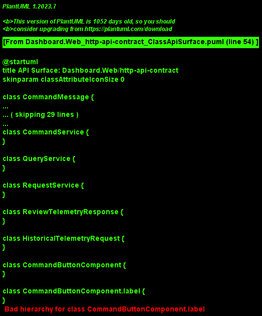

#### Frontend Services

Shows services with their message types and relationships. Services are connected to the messages they handle and responses they return.

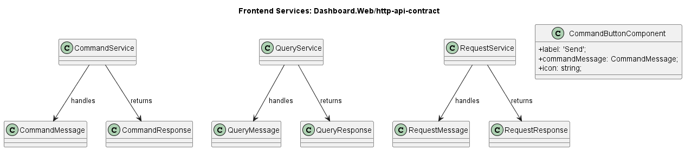

#### Message Interfaces

Shows the request/response message type pairs with `<<Message>>` and `<<Response>>` stereotypes and `produces` relationships.

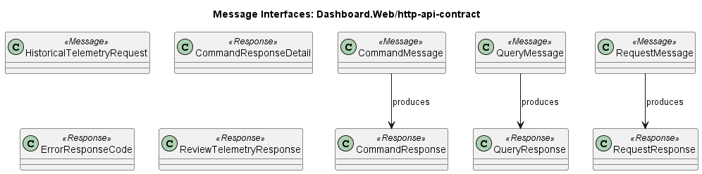

#### Domain Data Objects

Shows data types, enums, and their field-level properties with composition relationships.

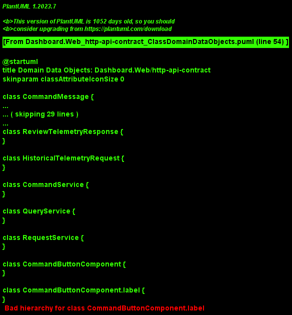

---

### Sequence Diagrams

Sequence diagrams show runtime interaction flows.

#### Request Flow

Shows how requests flow from consumer through provider services to the backend, with proper message and response type pairing.

```bash
seamq diagram --all --type sequence
```

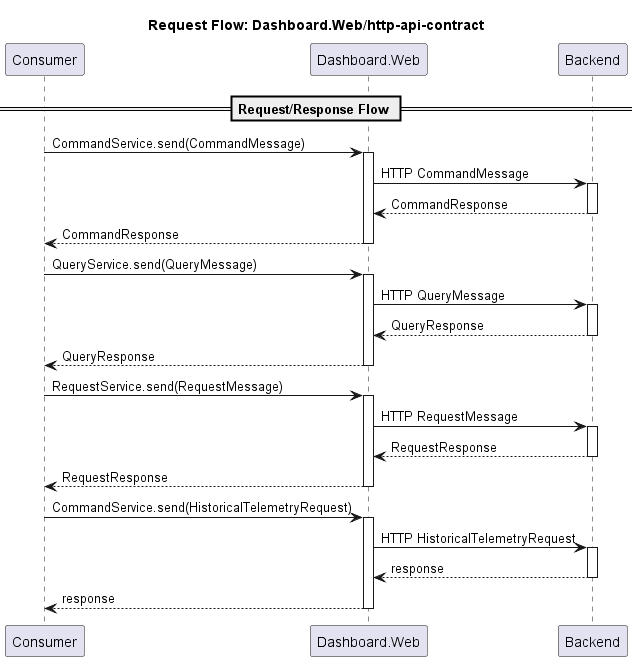

#### Command Flow

Shows the command dispatch pattern: consumer sends a command message, the command service validates, executes, emits events, and returns a response.

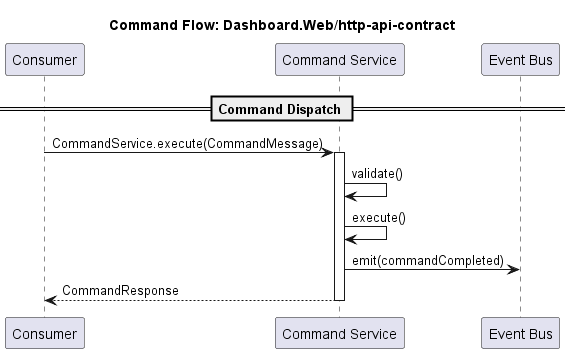

#### Query Flow

Shows the query execution pattern: consumer sends a query through the query service to the data store and receives results.

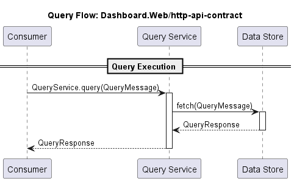

#### App Startup

Shows the application bootstrap sequence: host initialization, provider registration, consumer loading, and ready state.

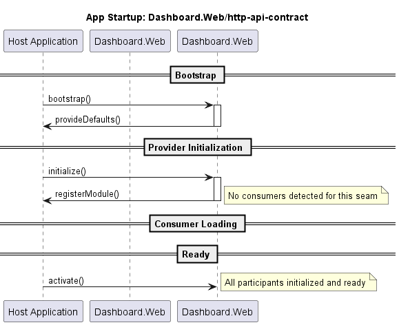

#### Error Handling

Shows success and error paths side by side, demonstrating how the system handles failures.

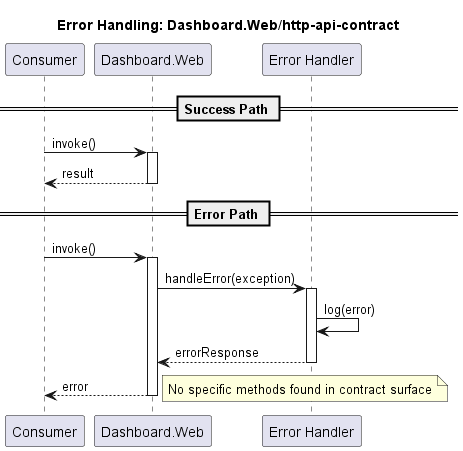

#### Data Consumption

Shows observable subscription patterns and data push flows from providers to consumers.

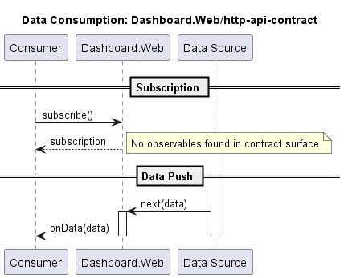

---

### C4 Architecture Diagrams

C4 diagrams show system architecture at different levels of abstraction.

#### Component Services

Shows all services, components, message types, and response types as C4 components within a system boundary, with `handles` and `returns` relationships.

```bash
seamq diagram --all --type c4-component
```

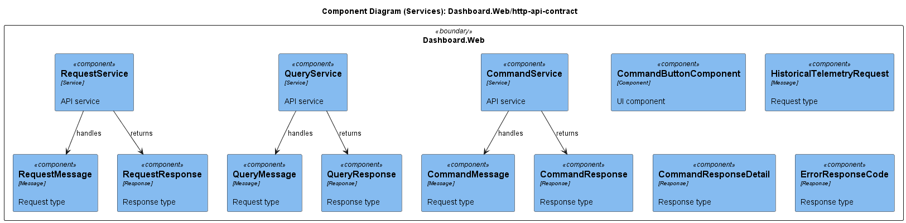

#### Plugin API Layers

Shows the layered architecture: Registration Layer (services), Contract Layer (messages), Binding Layer (components, enums, responses), and Runtime Layer.

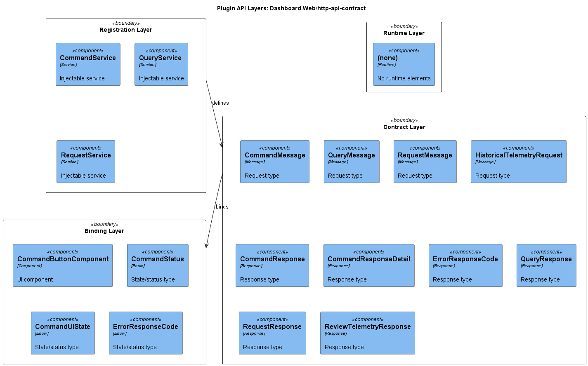

#### Data Flow

Shows how data flows through the system: services accept messages and return responses, with database-style containers for data payloads.

```bash
seamq diagram --all --type c4-container
```

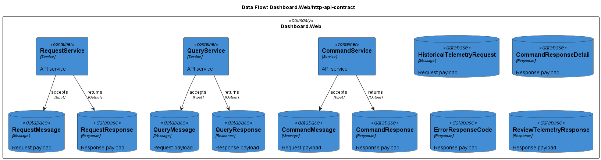

#### Dynamic Diagram

Shows numbered interaction steps across system boundaries: registration, service invocations, and data returns.

```bash
seamq diagram --all --type c4-code
```

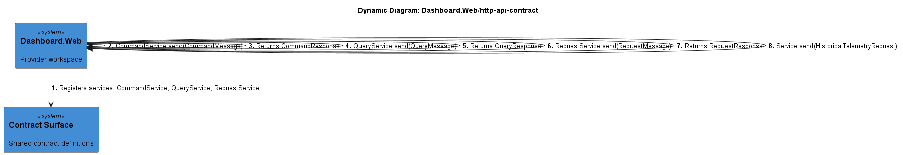

---

## Inspecting Seams

Get detailed contract surface information for a specific seam:

```bash
seamq inspect 68e7766a4dd5f012
```

Output includes:
- Seam metadata (type, provider, consumers, confidence score)
- All contract elements grouped by category
- Source file paths and line numbers for each element

### Example output

```
Dashboard.Web/http-api-contract
id          68e7766a4dd5f012
type        http-api-contract
provider    Dashboard.Web
consumers   (none)
confidence  40%
elements    19

  Types (19)
    CommandMessage
      projects/api/src/lib/models/command-message.ts:1
    CommandResponse
      projects/api/src/lib/models/command-message.ts:7
    CommandService
      projects/api/src/lib/services/command.service.ts:9
    QueryService
      projects/api/src/lib/services/query.service.ts:7
    RequestService
      projects/api/src/lib/services/request.service.ts:7
    ...
```

---

## Validating Contracts

Check that consumer workspaces correctly implement provider contracts:

### Validate all seams

```bash
seamq validate --all
```

### Validate a specific seam

```bash
seamq validate 68e7766a4dd5f012
```

### Example output

```
[ok] Dashboard.Web/http-api-contract
[ok] Dashboard.Web/shared-library
[ok] Dashboard.Web/plugin-contract
[ok] Dashboard.Web/state-contract

all 4 seam(s) valid.
```

Validation checks:
- Interface implementations
- Injection token provisioning
- Input/output binding compliance

Exit codes: `0` = all valid, `1` = errors found.

---

## Baseline Diffing

Track changes to your contract surface over time.

### Step 1: Save a baseline

```bash
seamq scan ./my-app --save-baseline baseline.json
```

### Step 2: Make changes to your code

### Step 3: Scan again and compare

```bash
seamq scan ./my-app
seamq diff baseline.json
```

The diff report shows:
- `+` Added contract elements
- `-` Removed contract elements
- `~` Modified contract elements

---

## Exporting Data

Export raw seam data as JSON for integration with external tools.

### Export all seams

```bash
seamq export --all
```

### Export a specific seam

```bash
seamq export 68e7766a4dd5f012
```

### Export to a specific directory

```bash
seamq export --all --output-dir ./data
```

Each seam exports three JSON files:
- `contract-surface.json` - All contract elements with metadata
- `data-dictionary.json` - Type definitions and field details
- `traceability-matrix.json` - Source file mappings

---

## Configuration

Create a `seamq.config.json` for persistent settings:

```bash
seamq init
```

### Example configuration

```json
{
  "workspaces": [
    {
      "path": "./src/Dashboard.Web",
      "alias": "Dashboard.Web",
      "role": "framework"
    }
  ],
  "output": {
    "directory": "./seamq-output",
    "formats": ["md", "html"]
  },
  "analysis": {
    "maxDepth": 10,
    "followNodeModules": false,
    "confidenceThreshold": 0.5
  },
  "icd": {
    "title": "Dashboard Interface Control Document",
    "documentNumber": "ICD-DASH-001",
    "revision": "A",
    "classification": "INTERNAL"
  }
}
```

### Workspace roles

| Role | Description |
|------|-------------|
| `framework` | The host application that defines the contract surface |
| `plugin` | A workspace that implements/consumes the contract |
| `library` | A shared library workspace |
| `application` | A standalone application |

### Using a config file

```bash
# Auto-discovered from current directory
seamq scan

# Explicit config path
seamq scan --config ./configs/seamq.config.json
```

### CLI flags override config

```bash
# Config says output to ./seamq-output, but override:
seamq generate --all --output-dir ./custom-output
```

---

## Rendering Diagrams to PNG/SVG

SeamQ outputs `.puml` source files. To render them as images:

### Using PlantUML JAR

```bash
# Install PlantUML (requires Java)
# Download from https://plantuml.com/download

# Render a single diagram
java -jar plantuml.jar -tpng my-diagram.puml

# Render all diagrams in a directory
java -jar plantuml.jar -tpng ./seamq-output/*/diagrams/*.puml

# Render as SVG
java -jar plantuml.jar -tsvg ./seamq-output/*/diagrams/*.puml
```

### Batch render all diagrams

```bash
# Generate diagrams
seamq diagram --all --output-dir ./output

# Render all to PNG
for f in ./output/*/diagrams/*.puml; do
  java -jar plantuml.jar -tpng "$f"
done
```

### Using Docker

```bash
docker run --rm -v $(pwd):/data plantuml/plantuml -tpng /data/output/*/diagrams/*.puml
```

### Using VS Code

Install the "PlantUML" extension by jebbs. Open any `.puml` file and press `Alt+D` to preview.

---

## CLI Reference

### Global Options

| Flag | Description |
|------|-------------|
| `--verbose` | Enable detailed logging |
| `--quiet` | Suppress all output except errors |
| `--no-color` | Disable ANSI color codes |
| `--output-dir <path>` | Override output directory |
| `--config <path>` | Specify config file path |
| `--version` | Show version |
| `--help` | Show help |

### Commands

| Command | Description |
|---------|-------------|
| `scan <paths...>` | Scan workspaces and build seam registry |
| `list` | List all detected seams |
| `generate [seam-id]` | Generate ICD documents |
| `diagram [seam-id]` | Generate PlantUML diagrams |
| `inspect <seam-id>` | Print detailed contract surface |
| `validate [seam-id]` | Check consumer contract compliance |
| `diff <baseline-path>` | Compare scan against a baseline |
| `init` | Generate seamq.config.json interactively |
| `export [seam-id]` | Export raw seam data as JSON |
| `serve` | Launch local web server to browse ICDs |

### Diagram Types

| `--type` Value | Diagrams Generated |
|----------------|-------------------|
| `class` | ApiSurface, FrontendServices, DomainDataObjects, RegistrationSystem, MessageInterfaces, RealtimeCommunication |
| `sequence` | AppStartup, PluginLifecycle, RequestFlow, QueryFlow, CommandFlow, DataConsumption, ErrorHandling |
| `c4-context` | C4 System Context |
| `c4-container` | C4 Container, C4 Data Flow |
| `c4-component` | C4 Component Services, C4 Plugin API Layers |
| `c4-code` | C4 Dynamic |
| *(omitted)* | All applicable diagrams |

### Exit Codes

| Code | Meaning |
|------|---------|
| `0` | Success |
| `1` | Partial failure (some errors/warnings) |
| `2` | Fatal error (cannot proceed) |

---

## Scenarios

### Scenario 1: First-time analysis of a new workspace

```bash
cd /path/to/angular-workspace
seamq init                              # Create config
seamq scan . --verbose                  # Analyze
seamq list                              # See what was found
seamq generate --all --format md html   # Generate ICDs
seamq diagram --all                     # Generate diagrams
seamq serve                             # Browse results at localhost:5050
```

### Scenario 2: CI/CD contract change detection

```bash
# In CI pipeline:
seamq scan ./app --save-baseline current.json
seamq diff previous-baseline.json
# Exit code 1 if changes detected
```

### Scenario 3: Generate only sequence diagrams for one seam

```bash
seamq scan ./app
seamq list                                    # Note the seam ID
seamq diagram abc123 --type sequence          # Only sequence diagrams
```

### Scenario 4: Full documentation export

```bash
seamq scan ./app --output-dir ./docs
seamq generate --all --format md html --output-dir ./docs
seamq diagram --all --output-dir ./docs
seamq export --all --output-dir ./docs
seamq validate --all --output-dir ./docs

# Render diagrams to images
for f in ./docs/*/diagrams/*.puml; do
  java -jar plantuml.jar -tpng "$f"
done
```

### Scenario 5: Monitor contract surface changes during development

```bash
# Start of sprint: save baseline
seamq scan ./app --save-baseline sprint-start.json

# During development: check for unintended changes
seamq scan ./app
seamq diff sprint-start.json

# Review: generate updated docs
seamq generate --all --format html --output-dir ./review-docs
seamq diagram --all --output-dir ./review-docs
```
